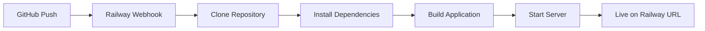

# Railway Deployment Summary

## ✅ Deployment Ready

Your Todo App repository is now fully configured for Railway deployment!

### 📦 What's Been Configured

#### 1. Core Configuration Files

- ✅ **`railway.json`** - Railway deployment configuration
  - Build and deploy commands
  - Restart policy configuration
  - Nixpacks builder specified

- ✅ **`nixpacks.toml`** - Build environment
  - Node.js 20.x LTS
  - Python, GCC, Make (for better-sqlite3)
  - SQLite dependencies
  - Singapore timezone preset
  - Proper build and start commands

- ✅ **`.railwayignore`** - Deployment optimization
  - Excludes development files
  - Excludes test outputs
  - Excludes documentation (not needed in production)
  - Keeps repository size minimal

#### 2. Docker Configuration

- ✅ **`nextjs_server/Dockerfile`** - Updated for Railway
  - SQLite dependencies in runtime
  - Persistent volume support at `/data`
  - Singapore timezone configuration
  - Dynamic PORT configuration
  - Optimized multi-stage build

#### 3. Environment Configuration

- ✅ **`.env.example`** - Updated with Railway variables
- ✅ **`.env.production.example`** - Production template
  - Database path for persistent volume
  - WebAuthn configuration placeholders
  - Singapore timezone
  - All required environment variables documented

#### 4. Documentation

- ✅ **`RAILWAY_QUICK_START.md`** - 5-minute deployment guide
- ✅ **`RAILWAY_DEPLOYMENT_CHECKLIST.md`** - Comprehensive deployment guide
- ✅ **`RAILWAY_SIMPLE_SETUP.md`** - Existing simple setup guide
- ✅ **`RAILWAY_DEPLOYMENT.md`** - Advanced deployment guide

### 🚀 Next Steps

#### Option 1: Quick Deploy (Recommended - 5 minutes)

Follow the **[RAILWAY_QUICK_START.md](./RAILWAY_QUICK_START.md)** guide:

1. Push to GitHub
2. Create Railway project from GitHub repo
3. Add persistent volume at `/data`
4. Set environment variables
5. Deploy!

#### Option 2: Comprehensive Deploy (15 minutes)

Follow the **[RAILWAY_DEPLOYMENT_CHECKLIST.md](./RAILWAY_DEPLOYMENT_CHECKLIST.md)** guide:

- Detailed step-by-step instructions
- Post-deployment configuration
- Troubleshooting guide
- Security checklist
- Performance optimization

### 🔑 Critical Configuration Requirements

#### 1. Persistent Volume (CRITICAL)

**Without this, your database will reset on every deployment!**

```
Mount Path: /data
Size: 1 GB (minimum)
```

Add in Railway: **Settings > Volumes > New Volume**

#### 2. Environment Variables (Required)

Minimum configuration:

```bash
NODE_ENV=production
TZ=Asia/Singapore
DATABASE_PATH=/data/todos.db
```

Add in Railway: **Variables tab**

#### 3. WebAuthn Configuration (If authentication enabled)

After domain generation:

```bash
NEXT_PUBLIC_RP_ID=your-app.railway.app
NEXT_PUBLIC_ORIGIN=https://your-app.railway.app
NEXT_PUBLIC_RP_NAME=Todo App
```

**Note:** Update with your actual Railway domain after deployment.

### 📋 Pre-Deployment Checklist

Before deploying, ensure:

- [ ] Code pushed to GitHub repository
- [ ] All tests passing locally
- [ ] Database path configurable via environment variable
- [ ] No hardcoded secrets or credentials
- [ ] `.gitignore` excludes sensitive files
- [ ] Ready to create Railway account

### 🧪 Post-Deployment Verification

After deployment succeeds:

- [ ] App loads at Railway URL
- [ ] Can create and save todos
- [ ] Database persists after redeploy
- [ ] Timezone shows Singapore time
- [ ] Calendar view works
- [ ] All features functional

### 📊 Railway Project Structure

```
Railway Project
├── Service (Next.js App)
│   ├── Settings
│   │   ├── Environment (Builder: Nixpacks)
│   │   ├── Networking (Generate Domain)
│   │   └── Volumes (/data - 1GB)
│   ├── Variables
│   │   ├── NODE_ENV=production
│   │   ├── TZ=Asia/Singapore
│   │   └── DATABASE_PATH=/data/todos.db
│   ├── Deployments (Auto-deploy on GitHub push)
│   └── Logs (Monitor application)
```

### 🔧 Technical Details

#### Database Architecture

- **Local Development:** SQLite file in project root or mock-db
- **Railway Production:** SQLite on persistent volume at `/data/todos.db`
- **Automatic Switching:** `lib/db.ts` detects environment
- **Persistence:** Volume ensures data survives deployments

#### Build Process

Railway automatically:

1. **Detects** Next.js project via `package.json`
2. **Reads** `railway.json` for configuration
3. **Uses** `nixpacks.toml` for build environment
4. **Installs** native dependencies (better-sqlite3)
5. **Builds** production Next.js bundle
6. **Starts** application on dynamic PORT

#### Deployment Flow



### 🎯 Expected Deployment Time

- **First Deployment:** 3-5 minutes
- **Subsequent Deployments:** 2-3 minutes
- **Automatic Deployments:** On every push to main

### 💰 Railway Pricing

- **Starter:** Free - $5 credit/month (Good for testing)
- **Developer:** $5/month - Better performance
- **Team:** $20/month - Production workloads

**Estimated usage for this app:** ~$3-5/month on free tier

### 🆘 Support Resources

#### Documentation

- **Quick Start:** [RAILWAY_QUICK_START.md](./RAILWAY_QUICK_START.md)
- **Full Checklist:** [RAILWAY_DEPLOYMENT_CHECKLIST.md](./RAILWAY_DEPLOYMENT_CHECKLIST.md)
- **Simple Setup:** [RAILWAY_SIMPLE_SETUP.md](./RAILWAY_SIMPLE_SETUP.md)
- **Advanced:** [RAILWAY_DEPLOYMENT.md](./RAILWAY_DEPLOYMENT.md)

#### External Resources

- **Railway Docs:** https://docs.railway.app
- **Railway Discord:** https://discord.gg/railway
- **Next.js Deployment:** https://nextjs.org/docs/deployment
- **better-sqlite3:** https://github.com/WiseLibs/better-sqlite3

### 🎉 You're Ready to Deploy!

Everything is configured and ready. Choose your deployment path:

**→ Quick & Easy:** [RAILWAY_QUICK_START.md](./RAILWAY_QUICK_START.md)  
**→ Comprehensive:** [RAILWAY_DEPLOYMENT_CHECKLIST.md](./RAILWAY_DEPLOYMENT_CHECKLIST.md)

---

## Configuration Files Reference

### Root Directory

```
c:\_MyGitRepos\AI-SDLC-Workshop-Day1n2-AIVA-NW\
├── railway.json                        # Railway deployment config
├── nixpacks.toml                       # Build environment
├── .railwayignore                      # Deployment exclusions
├── RAILWAY_QUICK_START.md              # 5-minute guide
├── RAILWAY_DEPLOYMENT_CHECKLIST.md     # Complete guide ⭐
└── nextjs_server/
    ├── Dockerfile                      # Docker configuration
    ├── .env.example                    # Development environment
    ├── .env.production.example         # Production template
    └── lib/
        ├── db.ts                       # Database selector
        ├── sqlite-db.ts                # SQLite implementation
        └── mock-db.ts                  # Development fallback
```

### Environment Variables Template

Copy from `.env.production.example` and update with your Railway domain:

```bash
# Required
NODE_ENV=production
TZ=Asia/Singapore
DATABASE_PATH=/data/todos.db

# WebAuthn (update after domain generation)
NEXT_PUBLIC_RP_ID=your-actual-domain.railway.app
NEXT_PUBLIC_ORIGIN=https://your-actual-domain.railway.app
NEXT_PUBLIC_RP_NAME=Todo App
NEXT_PUBLIC_APP_URL=https://your-actual-domain.railway.app

# Optional
NEXT_TELEMETRY_DISABLED=1
```

### Commands Summary

```bash
# Local development
npm run dev

# Local production build
npm run build && npm start

# Deploy to Railway (via GitHub)
git push origin main

# Railway CLI (optional)
railway login
railway link
railway up
```

---

**Deployment Status:** ✅ Ready  
**Last Updated:** February 6, 2026  
**Next.js Version:** 16.1.6  
**Node Version:** 20.x LTS  
**Database:** SQLite (better-sqlite3)
